# KLTN

# VNPay

Ngân hàng: NCB

Số thẻ: 9704198526191432198

Tên chủ thẻ:NGUYEN VAN A

Ngày phát hành:07/15

Mật khẩu OTP:123456

# 1. Lược đồ usecase

# 2. Sơ đồ class diagram

# 3. Mô tả chức năng
Nhóm Customer
-	Đặt phòng: Cho phép khách hàng lựa chọn khách sạn, loại phòng, ngày nhận/trả và tiến hành đặt phòng.
-	Yêu thích khách sạn: Người dùng có thể đánh dấu và lưu các khách sạn yêu thích để tham khảo sau.
-	Lịch sử giao dịch: Khách hàng có thể xem lại các đơn đặt phòng hoặc vé đã thanh toán hoặc bị hủy.
-	Xem chuyến bay: Hiển thị danh sách các chuyến bay phù hợp theo hành trình và thời gian mà người dùng tìm kiếm.
-	Đặt vé: Cho phép khách hàng lựa chọn chuyến bay và tiến hành đặt vé tương tự như đặt phòng.
-	Xem thông tin khách sạn: Hiển thị đầy đủ thông tin khách sạn bao gồm hình ảnh, tiện nghi, vị trí,...
-	Xem thông tin phòng (include): Chi tiết từng loại phòng trong khách sạn được tích hợp trong phần xem thông tin khách sạn.
-	Bình luận (extend): Sau khi xem hoặc đặt phòng, người dùng có thể viết đánh giá, bình luận về trải nghiệm.
-	Xem trang chủ: Giao diện tổng hợp gồm thanh tìm kiếm nhanh, các khuyến mãi, đề xuất khách sạn/chuyến bay nổi bật.
Nhóm User (mọi vai trò)
-	Đăng nhập: Người dùng đăng nhập vào hệ thống để sử dụng các chức năng cá nhân hoặc quản trị.
-	Đăng ký: Cho phép người dùng tạo tài khoản để sử dụng hệ thống.
-	Quên mật khẩu: Cung cấp chức năng lấy lại mật khẩu qua email xác minh.
-	Xem thông tin cá nhân: Hiển thị và chỉnh sửa thông tin cá nhân như tên, email, số điện thoại,...
-	Thêm, sửa, xóa thông tin cá nhân (extend): Cho phép người dùng cập nhật hoặc xóa một số thông tin nhất định.
Nhóm taff
-	Quản lý khách sạn: Nhân viên có thể thêm, sửa, xóa thông tin khách sạn do mình quản lý.
-	Quản lý phòng: Quản lý danh sách phòng thuộc các khách sạn, cập nhật loại phòng, số lượng, tiện nghi,...
-	Quản lý chuyến bay: Thêm, sửa hoặc xóa các chuyến bay bao gồm hành trình, giờ bay, hãng bay,...
-	Gửi thông báo: Nhân viên có thể gửi thông báo về tình trạng đơn hàng, khuyến mãi, cập nhật dịch vụ,...
-	Quản lý bình luận (extend): Có thể xem và xóa các bình luận vi phạm hoặc không phù hợp.
Nhóm Admin
-	Quản lý nhân sự: Admin có quyền thêm, xóa tài khoản nhân viên và phân quyền quản trị.
-	Thống kê: Xem tổng quan hệ thống như số người dùng, doanh thu, số lượng đơn đặt, đánh giá trung bình,...
# 4. Giao diện website
4.1. GIAO DIỆN TRANG CHỦ
 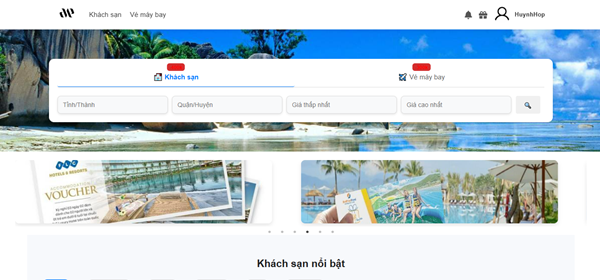
Hình 4. 1 Giao diện trang chủ
4.2. GIAO DIỆN TRANG HIỂN THỊ CÁC SẢN PHẨM
 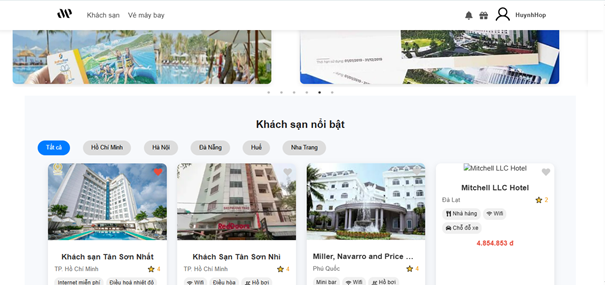
Hình 4. 2 Giao diện trang hiển thị các khách sạn

 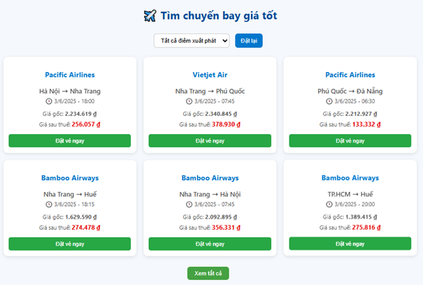
Hình 4. 3 Giao diện trang hiển thị các vé máy bay

4.3. GIAO DIỆN TRANG ĐĂNG NHẬP
 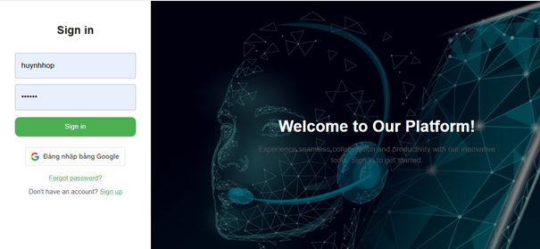
Hình 4. 4 Giao diện trang đăng nhập
4.4. GIAO DIỆN TRANG ĐĂNG KÝ
 
Hình 4. 5 Giao diện trang đăng ký
4.5. GIAO DIỆN TRANG TÌM KIẾM
 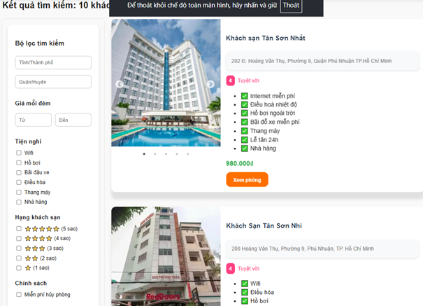
Hình 4. 6 Giao diện tìm kiếm của khách sạn

 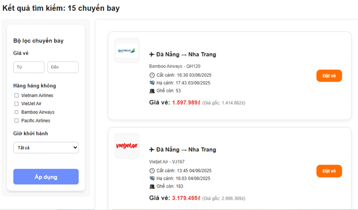
Hình 4. 7 Giao diện tìm kiếm của chuyến bay
4.6. GIAO DIỆN CHI TIẾT KHÁCH SẠN
 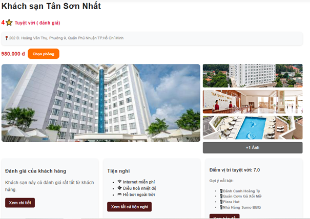
Hình 4. 8 Giao diện chi tiết khách sạn

4.7. GIAO DIỆN CHI TIẾT PHÒNG
 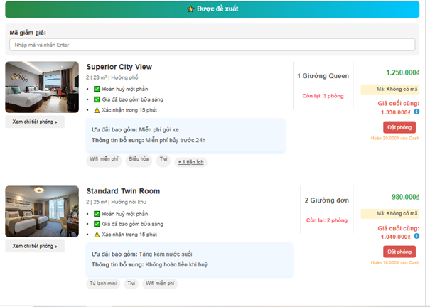
Hình 4. 9 Giao diện chi tiết phòng

4.8. GIAO DIỆN ĐẶT VÉ MÁY BAY
 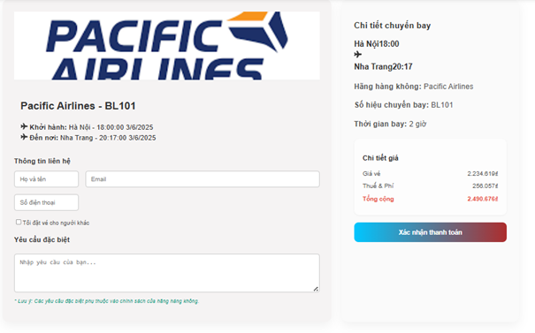
Hình 4. 10 Giao diện đặt vé máy bay

4.9. GIAO DIỆN TRANG ĐẶT PHÒNG KHÁCH SẠN
 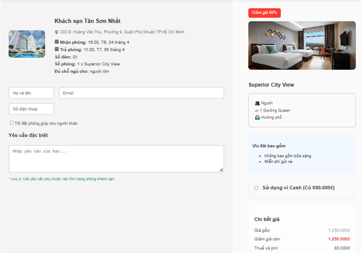
Hình 4. 11 Giao diện trang đặt phòng khách sạn
4.10. GIAO DIỆN NGƯỜI DÙNG
 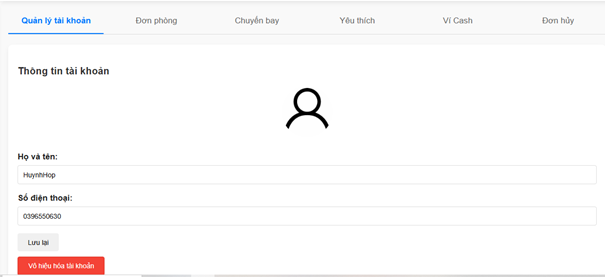
Hình 4. 12 Giao diện người dùng

4.11. GIAO DIỆN DANH SÁCH PHÒNG ĐÃ ĐẶT
 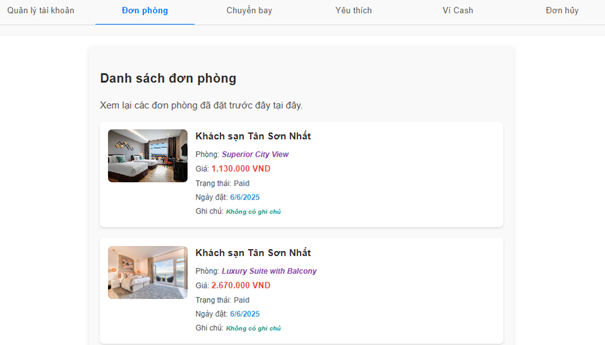
Hình 4. 13 Giao diện danh sách phòng đã đặt
4.12. GIAO DIỆN DANH SÁCH KHÁCH SẠN YÊU THÍCH
 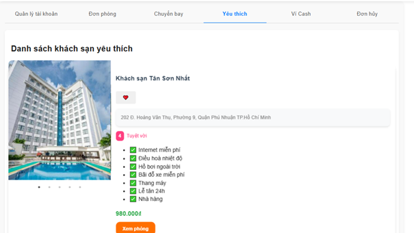
Hình 4. 14 Giao diện danh sách khách sạn yêu thích

4.13. GIAO DIỆN VÍ CASH
 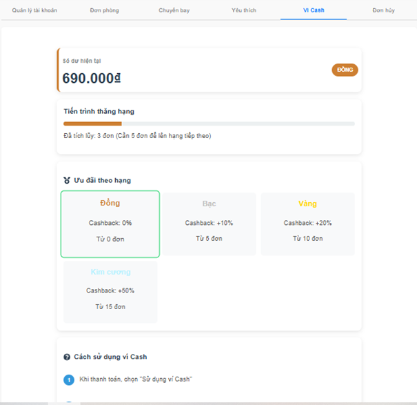
Hình 4. 15 Giao diện ví cash

